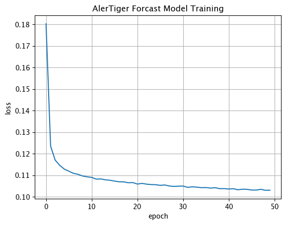

# AlerTiger: A Deep-learning Time Series Anomaly Detection Framework

AlerTiger is a deep-learning-based time series anomaly detection algorithm designed for monitoring AI models' healthiness.

As a generic time series anomaly detection framework for MLOps, AlerTiger be pre-trained offline with a set of univariate
time series with anomaly labeled, and then be generically deployed online for detecting anomalies without much
fine-tuning.

In this release, we support time series data of daily granularity, but we plan to extend to other granularity (e.g.
hourly). More details can be found in the LinkedIn Engineering blog posts (coming soon).


## Highlight

- **Generalizability**: The AlerTiger model has built-in normalization layer and seasonality-adaption layer that allow the
  model to be suitable for time series of various scales and can handle both noisy and seasonal time series well without
  any fine-tuning. In the production MLOps model alerting setting, our solution demonstrates broad generalizability. We
  successfully trained one model capable of accurately detecting anomalies for virtually all different AI features with
  different historical patterns. We have productionized the solution for most of LinkedIn’s AI models with high
  performance.
- **No Assumption on Gaussian Distribution**: By adding quantile loss to the commonly used RMSE, our neural network
  estimates a non-parametric distribution of the underlying data, which is practical when real data usually does not
  follow Gaussian distribution.
- **Scalability**: The model framework can be easily scaled to incorporate various components (e.g. LSTM, CNN,
  Transformer modules).
- **Fast and Lightweight Training and Inference**: The model's offline training is fast and does not require much
  computation resources: In our benchmarking, the training takes roughly 10-20 minutes on single CPU Macbook Pro (2019
  version) for 200 pieces of univariate time series and each lasting for 1 year. The speed can be further improved with
  GPU
  acceleration if needed. (Check it out in our demo notebook.)

## Introduction

Data-driven companies widely use AI models to develop products and intelligent business solutions. Consequently,
ensuring AI models’ health is essential for business success. At LinkedIn, we developed a deep-learning-based anomaly
detection solution that helps AI teams across the company monitor their AI model's healthiness by detecting anomalies in
a model’s input features and output score over time. The pipeline consists of four major steps: model statistics
generation, anomaly detection, post-processing, and user alerting. Model monitoring and alerting poses several unique
challenges, including a lack of clear model health metrics definition, label sparseness, and fast model iterations that
result in short model and feature lifespans. As a product, there is also the requirement for scalability,
generalizability, and explainability. To tackle these challenges, we propose a deep-learning-based MLOps model
monitoring system named AlerTiger that achieves high issue detection performance and is generalizable forAI models with
different historical patterns. Our work is among the earliest attempts to bring deep learning time-series anomaly
detection to model healthiness monitoring in the MLOps domain. Our approach has been deployed to most of LinkedIn’s
production AI models for over a year. It has achieved several success stories by notifying and triggering teams to
improve their models when the system identifies concerning behavior.

## Generic Model Architecture


## User Guide

### Dev environment set up

**Note for Macbook with Apple Silicon (M1, M2)**: you may want to follow Apple's instruction to install the TensorFlow
here at https://developer.apple.com/metal/tensorflow-plugin/ instead of `pip install tensorflow`

1. Create your virtualenv (Python version >= 3.7)
    ```shell script
    VENV_DIR=<your venv dir> # e.g. VENV_DIR="~/Desktop/alertiger_venv"
    python3 -m venv $VENV_DIR  # Make sure your python version >= 3.7
    source $VENV_DIR/bin/activate  # Enter the virtual environment
    ```
1. Upgrade pip and setuptools version
    ```shell script
    pip3 install -U pip
    pip3 install -U setuptools
    ```
1. Download AlerTiger code from GitHub (Note: This link will be updated once fully OpenSourced). We will later make
   AlerTiger available on PyPI, and right now can be installed via `git clone`.

    ```shell script
    git clone git@linkedin.ghe.com:zhexu/AlerTiger.git
    ```
1. Install the dependency libraries
    ```sh
    pip3 install -r ./AlerTiger/requirements.txt
    ```
1. Open Jupyter notebook for end-end demos.
    ```sh
    jupyter notebook ./AlerTiger/alertiger_demo.ipynb
   ```

### Notebook Walkthrough with Examples.

You can run the [notebook](./alertiger_demo.ipynb) end-to-end, but here is a quick code walk through to help you
understand the high-level code
structure.

1. Mock time series: we provide a mock time series creation utility function for creating mock time series of various
   shapelets (
   square, triangle, sine, constant) with various anomaly types (level-shift, spike).
    ```python
    from alertiger.src.utils import mock_univariate_time_series_with_anomaly, visualize_time_series_with_anomaly
    import datetime
    
    # mock time series
    training_univariate_timeseries: list = mock_univariate_time_series_with_anomaly(
        start_date=datetime.date(2022, 1, 1),
        end_date=datetime.date(2023, 1, 1))
    # visualize time series
    visualize_time_series_with_anomaly(training_univariate_timeseries[0])
    ```
   

   2. Model Training: we provide a model training function `train_alertiger_model` for training model
       ```python
       import datetime

       from alertiger.src.trainer import train_alertiger_model
       from matplotlib import pyplot as plt
   
       # model training
       alertiger_keras_model, history_forecast, history_classification = train_alertiger_model(
           training_univariate_timeseries,
           epoch=2,
           start_date=datetime.date(2022, 1, 1),
           end_date=datetime.date(2023, 1, 1))
       # visualize the training process
       plt.plot(history_forecast.history['loss'])
       plt.plot(history_classification.history['loss'])
       ```

      | AlerTiger Forecast Model Training                         | AlerTiger Classification Model Training                       | 
      |---------------------------------------------------------|---------------------------------------------------------------|
      |  |  |


3. Model Scoring and Visualization: we provide a model inferencing function `inference_alertiger_model`, which takes the
   univariate time series and the trained alertiger model as the input for scoring and visualization.
    ```python
    import datetime
    from alertiger.src.utils import mock_univariate_time_series_with_anomaly, visualize_time_series_with_anomaly
    from alertiger.src.inferencer import inference_alertiger_model

    # mock the test times eries
    testing_univariate_timeseries  = mock_univariate_time_series_with_anomaly(
        start_date=datetime.date(2023, 1, 1),
        end_date=datetime.date(2023, 4, 1))
   
    # model inference (anomaly detection)
    prediction_result_dataframes = inference_alertiger_model(
        testing_univariate_timeseries,
        alertiger_keras_model)
    
    # visualzie the forecasting and anoamly detection result.
    visualize_time_series_with_anomaly(prediction_result_dataframes[0])  
    ```

   | Regular timeseries with weekly seasonality                                              | Noisy timeseries                                                                    | 
   |-----------------------------------------------------------------------------------------|-------------------------------------------------------------------------------------|
   |  |  |

## Execution Speed

The environment is a Macbook Pro 2019 Version (w/ 2.4 GHz 8-Core Intel Core i9 CPU).

| Training Dataset                               | Training Setting | AlerTiger Model Details                                                                                               | Training Time                                                                                                                                  |
|------------------------------------------------|------------------|-----------------------------------------------------------------------------------------------------------------------|------------------------------------------------------------------------------------------------------------------------------------------------|
| 200 pieces of time series, each of length 365. | epoch = 50       | default configuration: <br/> (1466 parameters in forecast component;<br/> 389 parameters in classification component) | 11 mins in total, with breakdowns: <br/> - 2.5 mins feature engineering;<br/> - 5 mins forecasting model;<br/> - 3.5 mins classification model |

## Citation

TODO: We will add the link to our paper here once the paper is published.

## License

Copyright (c) LinkedIn Corporation. All rights reserved. Licensed under
the [CC-BY-NC-4.0](https://creativecommons.org/licenses/by-nc/4.0/legalcode) License.
